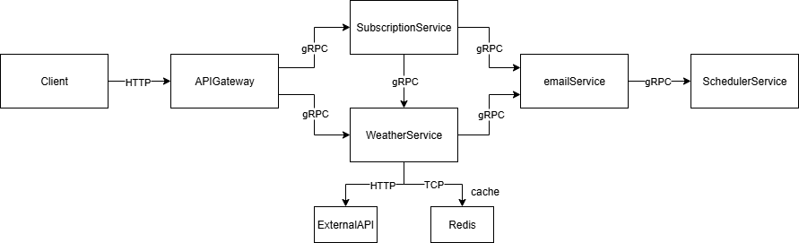

# Weather Forecast Email Subscription – Microservices Architecture

## Objective

This document outlines the proposed microservices architecture for the existing monolithic application that handles weather forecast email subscriptions. It identifies which modules should be extracted into separate services and proposes optimal communication strategies between them.

---

## 🧱 Microservices Breakdown

The monolith will be decomposed into the following independent microservices:

### 1. **API Gateway**
- **Responsibility:** Serves as the single entry point to the system.
- **Purpose:** Handles HTTP requests from external clients and forwards them via gRPC to internal services.
- **Interface:** HTTP (REST)

---

### 2. **Subscription Service**
- **Responsibility:** Manages user subscriptions (creation, confirmation, deletion).
- **Stores:** User email, subscription frequency (`hourly`, `daily`).
- **Interface:** gRPC

---

### 3. **Weather Service**
- **Responsibility:**
    - Retrieves current weather data from external APIs.
    - Caches data for reuse.
- **Dependencies:**
    - External weather API (via HTTP)
    - Redis (for cache)
- **Interface:** gRPC (for internal calls), HTTP (to external API), TCP (to Redis)

---

### 4. **Email Service**
- **Responsibility:**
    - Sends confirmation, forecast, and unsubscribe emails.
    - Supports email templates.
    - May handle background jobs or delayed sending.
- **Interface:** gRPC (called by Subscription & Weather services)

---

### 5. **Scheduler Service**
- **Responsibility:**
    - Triggers scheduled jobs (daily/weekly forecast emails).
- **Interface:** gRPC

---

## 🔗 Communication Strategy

The optimal communication methods between services are as follows:

| Source                | Destination         | Purpose                                                     | Protocol / Method     |
|-----------------------|---------------------|-------------------------------------------------------------|------------------------|
| Client                | API Gateway         | Entry point for HTTP requests                               | **HTTP REST**          |
| API Gateway           | Subscription Service| Manage user subscriptions                                   | **gRPC**               |
| API Gateway           | Weather Service     | Fetch weather info                                          | **gRPC**               |
| Subscription  service | Email Service       | Send confirmation or unsubscribe email                      | **gRPC**               |
| Subscription service  | Email Service       | Validates the user-provided city by requesting weather data | **gRPC**               |
| Weather Service       | External API        | Get weather forecast data                                   | **HTTP**               |
| Weather Service       | Redis               | Read/write cached weather data                              | **TCP / Redis client** |
| Weather Service       | Email Service       | Send weather forecast to users                              | **gRPC**               |
| Scheduler Service     | Email Service       | Initiate forecast email dispatch                            | **gRPC**               |

---

## 🧠 Diagram Reference

The following diagram illustrates the overall architecture and communication flow:

