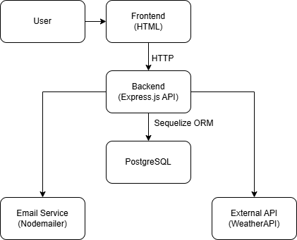

# Weather Forecast Subscription Service - System Design Document

**Date:** 2025-06-08  
**Author:** Stanislav Nikonov 

---

## 1. System requirements

### Functional requirements

* Users can subscribe by providing email, city, and frequency
* Users can get weather information for a specific city
* Subscription requests are validated
* A confirmation email is sent upon subscribing
* Users can confirm their subscription via a unique link
* Weather forecasts are emailed based on selected frequency
* Users can unsubscribe via a link in the email

### Non-functional requirements

- **Availability:** 99.9% uptime
- **Scalability:** up to 100,000 users, up to 1,000,000 notifications per day
- **Latency:** < 200 ms for API requests
- **Security:** Confirmation tokens are UUIDs, no passwords stored
- **Reliability:** Subscription must be confirmed before activation
- **Usability:** Simple and intuitive HTML form for end-users

## 2. Load estimation

### Users and traffic

- **Active users:** 60,000
- **Subscriptions per user:** 4-5 (average)
- **API requests:** up to 2,000 RPS (peak)
- **Notifications:** up to 500,000 per day

### Data

- **User record:** ~300 bytes
- **Subscription record:** ~400 bytes
- **Weather cache:** ~2 KB per city
- **Total storage:** ~90 GB/year

### Bandwidth

- **Incoming:** 2 Mbps
- **Outgoing:** 4 Mbps (emails)
- **External API:** 50 Mbps

## 3. High-level Architecture



## 4. Component design

### 4.1 API Service (Node.js + Express.js)

**Responsibilities:**
- Handling REST API requests
- Email confirmation
- Data validation
- CRUD operations with subscriptions


  **Endpoints:**
````
  /api/subscribe - Create new weather subscription
  /api/confirm/${token} - Confirm a subscriber via email link
  /api/unsubscribe/${token} - Cancel an existing subscription
  /api/weather -  Get current weather
````

### 4.2 Database

**Responsibilities:**
- Storing data
- Fast search and filtering

#### Table: `Subscriptions`

| Field      | Type     | Description                            |
|------------|----------|----------------------------------------|
| id         | UUID     | Unique subscription identifier         |
| email      | STRING   | User's email address                   |
| city       | STRING   | Subscribed city                        |
| frequency  | ENUM     | `daily` or `hourly`                    |
| confirmed  | BOOLEAN  | Whether the user has confirmed         |
| token      | STRING   | Confirmation token (UUID)              |
| createdAt  | DATE     | Record creation timestamp              |
| updatedAt  | DATE     | Last update timestamp                  |

### 4.3 Scheduled Jobs

**Responsibilities:**
- Runs every hour and once daily
- Selects all confirmed subscriptions matching the frequency
- Fetches weather data from OpenWeatherMap API
- Sends email with forecast to each user

### 4.4 Email Workflow

**Responsibilities:**
- On subscription: a confirmation email is sent
- On confirmation: the user is marked as confirmed
- Periodically: forecasts are sent to confirmed users based on frequency

## 5. Testing Strategy
This project uses Jest and Supertest for automated API testing.
Tests are located in the __tests__ directory and cover the core logic of the application.

### What is tested

1. POST /api/subscribe
* Subscribing with valid data returns confirmation message.
* Invalid email formats are rejected.
* Missing required fields return validation errors.
* Invalid city names return an error.

2. GET /api/confirm/:token
* Valid tokens confirm a subscription and redirect to the success page.
* Invalid tokens return a 404 error.

3. GET /api/unsubscribe/:token
* Valid tokens unsubscribe the user and redirect to the unsubscribe confirmation page.
* Invalid tokens return a 404 error.

4. GET /api/weather?city=...
* Valid city names return temperature, humidity, and description.
* Missing or incorrect city names return proper error messages.

## 6. Future Improvements

- Add admin dashboard with analytics and logs
- Introduce rate limiting on form submissions
- Add retry mechanism for failed email deliveries
- Integrate frontend validation and reCAPTCHA


